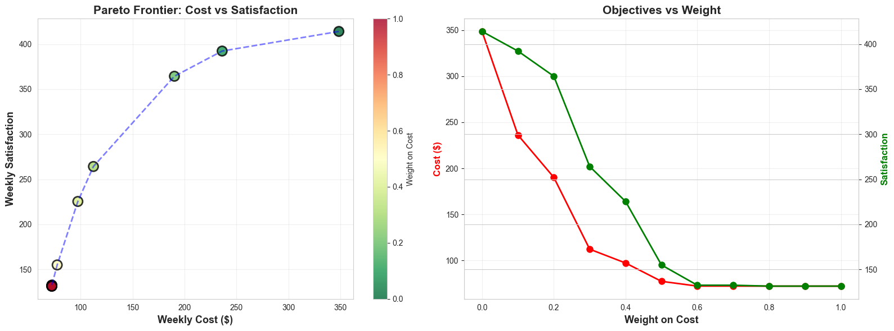
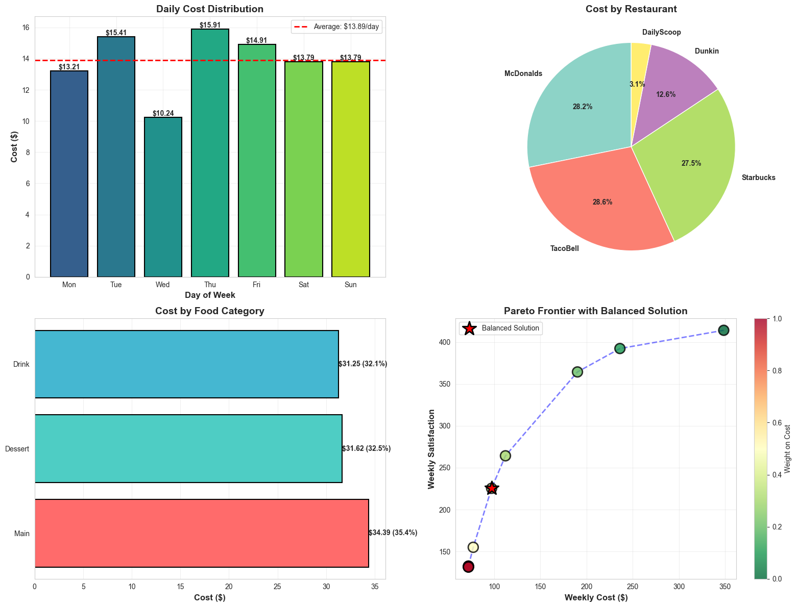
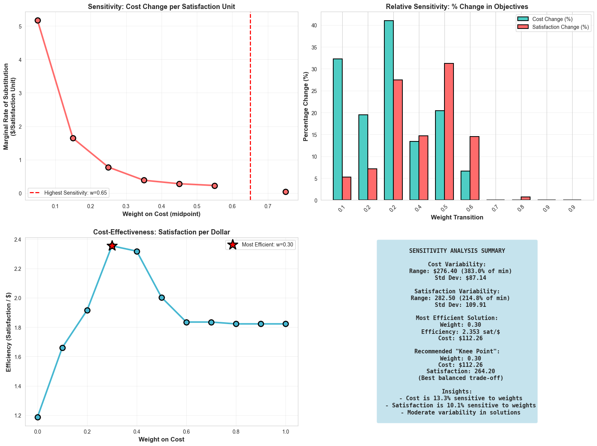

# MyDietPlan

**CS 524: Introduction to Optimization**  
Multi-Objective Diet Optimization with Habituation-Adjusted Satisfaction

> **Open [`FinalProjectReport.ipynb`](FinalProjectReport.ipynb) to read the full report.**  
> That notebook has the problem setup, GAMSPy model, Pareto results, and sensitivity analysis.

The model picks a 7-day meal plan from restaurants near UW-Madison, trading off **cost** and **satisfaction** while meeting nutrient targets and penalizing eating the same foods too often.

## What’s in the report

| Figure | What it shows |
| --- | --- |
| Pareto frontier (above) | Optimal cost–satisfaction trade-offs as the objective weights change |
| Cost breakdown | Daily spend, restaurant mix, and food categories for the balanced plan |
| Sensitivity | How much each extra satisfaction point costs, and the recommended “knee” point |

Preview more figures from the notebook

## How to run it

1. Open **[`FinalProjectReport.ipynb`](FinalProjectReport.ipynb)** in Jupyter or VS Code / Cursor.
2. Keep the CSV files in this folder (`nutrient_data.csv`, `food_prices.csv`, `food_satisfaction.csv`, `nutrient_constraints.csv`, `model_config.csv`).
3. Install Python 3.8+ with GAMSPy, NumPy, Pandas, Matplotlib, and Seaborn, then run all cells.

See [`WORKING_CONFIG_GUIDE.md`](WORKING_CONFIG_GUIDE.md) if a related model is infeasible.
